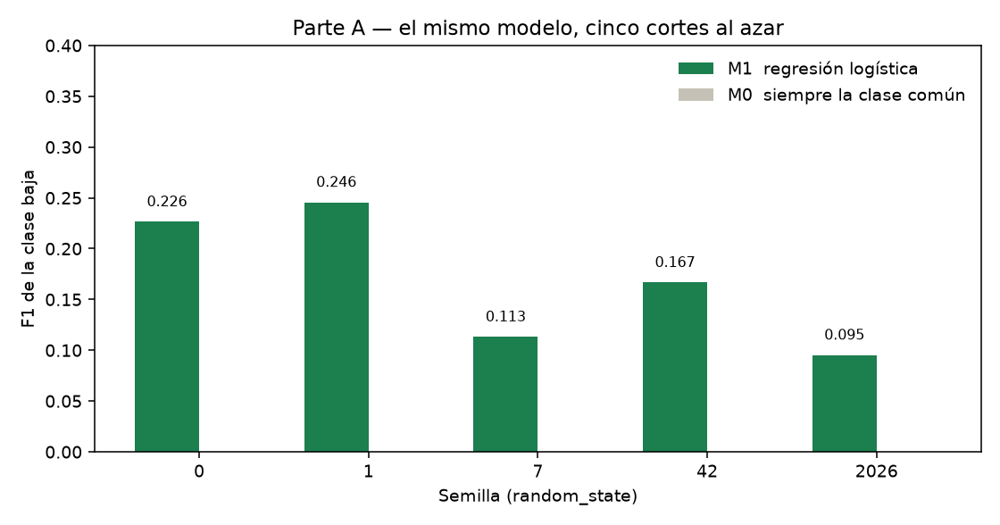
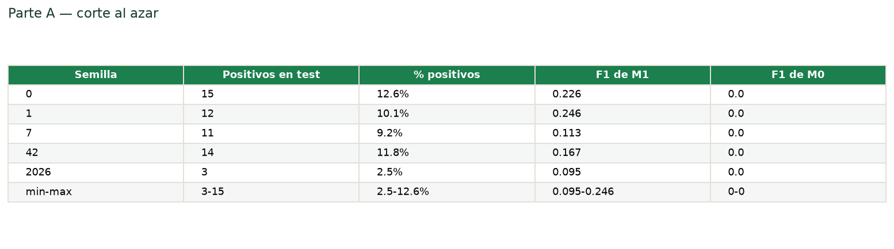
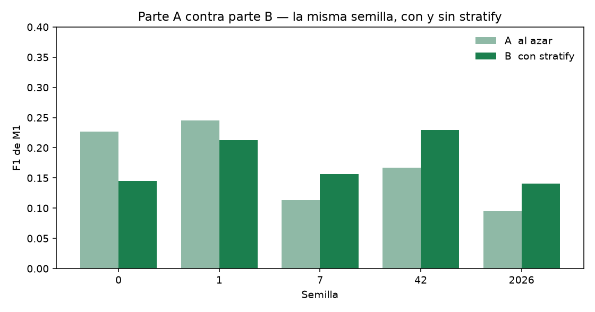
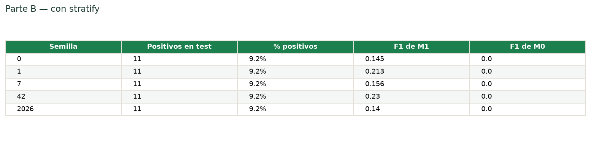
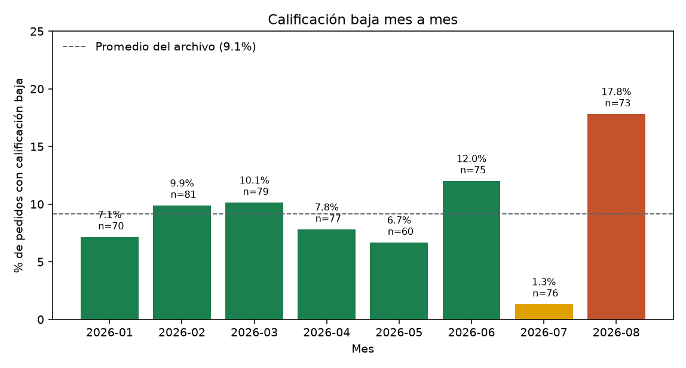
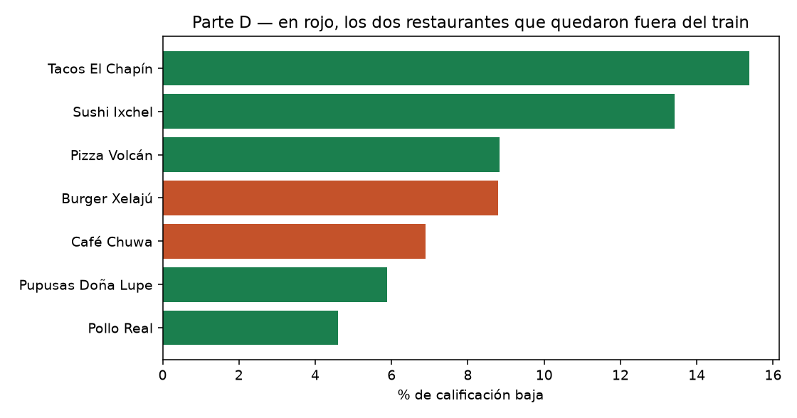
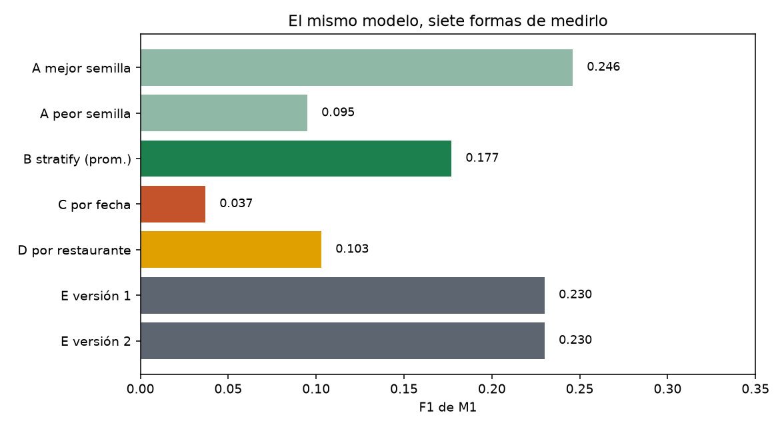
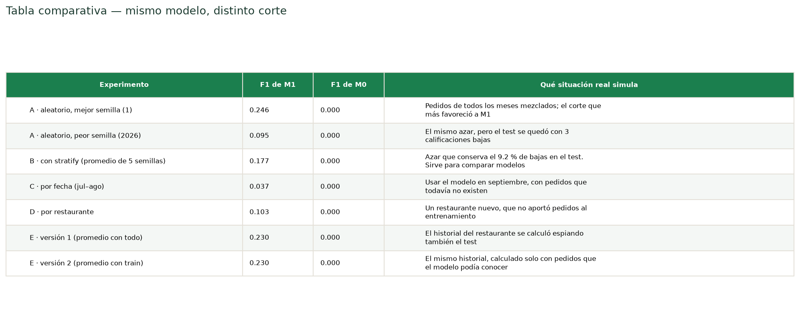

# Bitácora — Laboratorio 9

**¿Importa cómo partimos los datos?**
Universidad Rafael Landívar · Facultad de Ingeniería · Ciencia de Datos · Sección 2
Ing. Max Cerna · Segundo semestre 2026

**Estudiante:** Smorareq1. Entrega individual: la misma persona programó, registró las tablas y dejó la predicción antes de cada ejecución.

El modelo es siempre el mismo. M1 es la regresión logística del enunciado (mediana, escalado, one-hot, `class_weight='balanced'`). M0 es un `DummyClassifier` que siempre responde la clase más común. Lo único que cambia es cómo se separan train y test.

**Uso de IA.** Cursor ayudó a ordenar el notebook, correr el código y redactar esta bitácora. Las predicciones quedaron escritas como hipótesis, y donde fallaron se explica con el número de esta corrida. El razonamiento se puede reconstruir sin la herramienta: lo que se mueve no es el modelo, es el corte.

---

## 1. Qué hay en el archivo

`pedidos_ruta_verde.csv` trae **626 pedidos**, **7 restaurantes** y fechas del **1 de enero de 2026 al 31 de agosto de 2026**.

| Columna | Nulos |
|---|---:|
| `distancia_km` | 20 |
| `calificacion` | 35 |
| el resto | 0 |

`tiempo_entrega_min` va de **−9.5 a 196.5**. Hay **4 tiempos negativos** (−9.5, −5.8, −3.9, −3.0). Un tiempo de entrega negativo es imposible. 196.5 minutos es extremo, pero el filtro de la pregunta de regresión (`> 0` y `< 200`) todavía lo deja pasar.

`metodo_pago` está escrito de dos formas (`Tarjeta` / `TARJETA`, y lo mismo con efectivo y transferencia): 15 filas en mayúsculas. No se unifican. Cambiar el texto cambiaría las columnas que ve el modelo y rompería la comparación con otros grupos.

De los 591 pedidos con calificación, el **9.1 %** es calificación baja (1 o 2 estrellas). Esa es la clase que M1 intenta detectar.

### Pregunta 1

Para predecir el tiempo de entrega en el momento en que entra el pedido no se pueden usar:

- `tiempo_entrega_min`, porque es lo que se quiere predecir y todavía no ocurrió.
- `calificacion`, porque el cliente califica después de recibir.

Fecha, ubicación, restaurante, categoría, método de pago, total y distancia sí existen en ese momento. La distancia se estima con las dos direcciones antes de que salga el repartidor.

### Pregunta 2

**Predicción, antes de medir:** el F1 de M0 va a ser 0.

**Qué pasó:** fue 0 en todas las partes. "No baja" es la clase mayoritaria. Un modelo que siempre responde eso no acierta ni un positivo, y el F1 de la clase baja queda en cero.

---

## 2. Parte A — cinco cortes al azar

80 % train, 20 % test. Solo cambia la semilla.

**Predicción:** el F1 no iba a ser idéntico, pero tampoco muy distinto. Se esperaba una brecha de unas pocas centésimas.

M0 no se ve en la gráfica porque su F1 es 0 en las cinco semillas.

### Pregunta 3

La predicción se quedó corta. Entre la semilla 1 (**0.246**) y la semilla 2026 (**0.095**) hay **0.150**. El mismo modelo parece más del doble de bueno solo porque el azar repartió otros 119 pedidos al test. El promedio de las cinco es **0.169**.

### Pregunta 4

Si otro grupo reporta otro F1 con este modelo y este archivo, los dos pueden tener razón. Cada semilla es otro examen. No se reporta el mejor número de la tabla: ese es el corte que más favorece. Si se va a usar un corte al azar, se reporta el rango (0.095 a 0.246) o el promedio (0.169), y al lado el F1 de M0.

### Pregunta 5

La semilla 2026 deja **3 positivos** (2.5 %, contra 9.1 % del archivo) y saca el peor F1. Con tres casos, fallar uno mueve el recall de golpe, y el modelo además marca muchos pedidos sanos como bajos: la precisión se cae.

No es "más positivos, mejor F1". La semilla 0 tiene 15 positivos y un F1 de 0.226; la semilla 1 tiene 12 y un F1 de 0.246. Lo que sí se ve es que un test que no conserva la proporción real deja de ser comparable con los demás.

---

## 3. Parte B — `stratify`

`stratify` obliga a que train y test tengan la misma proporción de "baja" que el archivo completo.

**Predicción:** el promedio del F1 no iba a subir de forma clara. Iba a cambiar la dispersión: el porcentaje de positivos iba a quedar fijo y las semillas se iban a parecer más.

### Pregunta 6

| | Promedio del F1 | Brecha máx − mín | Positivos en el test |
|---|---:|---:|---|
| A, al azar | 0.169 | 0.150 | de 3 a 15 |
| B, con stratify | 0.177 | 0.089 | 11 en las cinco |

El promedio sube poco. La brecha baja, y desaparece el test de la semilla 2026, que se había quedado con 3 positivos. Las cinco pruebas miran un test con 11 bajas (9.2 %).

### Pregunta 7

Stratify no hace que el modelo prediga mejor. No ve columnas nuevas. Hace que la medición sea más justa: ninguna semilla puede armar un test casi sin casos "baja". Sigue habiendo movimiento (0.140 a 0.230) porque cambian los pedidos concretos. Stratify controla el cuántos, no el cuáles.

### Pregunta 8

Hace falta cuando la clase importante es escasa y el test es chico. Aquí "baja" es el 9 % y el test tiene 119 filas: sin stratify, una semilla dejó 3 positivos y el F1 se desplomó por la muestra.

Da casi igual cuando las clases están cerca de 50/50 y el test es grande. Ahí el azar ya conserva la proporción.

---

## 4. Parte C — separar por fecha

El azar había mezclado todos los meses. Esta gráfica es la tasa de calificación baja mes a mes. Verde: enero–junio. Amarillo: julio. Rojo: agosto.

De enero a junio la tasa anda entre 6.7 % y 12.0 %. Julio cae a **1.3 %** (1 de 76). Agosto sube a **17.8 %** (13 de 73). Juntos, julio y agosto vuelven a quedar cerca del 9 %. El promedio esconde el quiebre.

**Predicción, después de ver la gráfica:** el F1 iba a salir peor que con el corte al azar.

Se entrenó con enero–junio (442 pedidos, 9.0 % de bajas) y se probó con julio–agosto (149 pedidos, 9.4 % de bajas).

### Pregunta 9

La predicción acertó, y el golpe fue más fuerte de lo esperado.

| Corte | F1 de M1 | F1 de M0 | Recall |
|---|---:|---:|---:|
| A, promedio | 0.169 | 0.000 | — |
| C, jul–ago | **0.037** | 0.000 | 0.071 |

De 14 pedidos bajos en el test, el modelo marca bien uno. M1 le gana a M0, y aun así no le sirve a la operación.

No falló porque la tasa global hubiera cambiado: 9.4 % contra 9.0 %. Falló porque el fenómeno cambió de forma. Julio está casi vacío de bajas y agosto concentra 13 de las 14. El corte al azar no muestra ese quiebre: mete pedidos de agosto en el train y el modelo alcanza a ver el futuro.

### Pregunta 10

Para usar el modelo en septiembre, con pedidos que todavía no existen, la medición de fecha se parece más. En septiembre el modelo solo puede haber aprendido de lo ya ocurrido. El corte al azar contesta otra pregunta: qué pasa si el futuro es una mezcla del pasado.

### Pregunta 11

Un pedido del 8 de agosto en el train y uno del 3 de febrero en el test invierten el tiempo. El examen estudia con el futuro. En producción nunca se predice febrero después de haber aprendido agosto. Por eso el F1 aleatorio sale optimista.

---

## 5. Parte D — separar por restaurante

**Predicción:** el F1 iba a bajar si dos restaurantes completos se quedan fuera del train.

En el corte al azar con semilla 42, **los 7 restaurantes del test también están en el train**. Ese corte no responde qué pasa con un local nuevo.

`GroupShuffleSplit` (`test_size=2/7`, semilla 42) dejó en el test a **Burger Xelajú** y **Café Chuwa**. En la gráfica están en rojo.

### Pregunta 12

| | F1 de M1 | F1 de M0 | Recall |
|---|---:|---:|---:|
| A, promedio | 0.169 | 0.000 | — |
| D, dos restaurantes fuera | **0.103** | 0.000 | 0.214 |

El F1 bajó. La predicción acertó en la dirección. No llegó al 0.037 del corte por fecha.

El modelo no usa el nombre del restaurante. Usa zona, categoría, método de pago, distancia y total, y esas columnas también existen en un local nuevo, así que algo se transfiere. Aun así cada local tiene su propia tasa: Pollo Real anda en 4.6 % y Tacos El Chapín en 15.4 %. Burger Xelajú y Café Chuwa están en la mitad baja de quejas; el train incluye a los dos locales con más bajas.

### Pregunta 13

Para un restaurante que nunca ha tenido pedidos, la parte D es la medición que describe mejor al modelo. El corte al azar, el estratificado y el de fecha siguen usando los mismos siete locales. Solo el group split obliga a puntuar a alguien que no estuvo en el entrenamiento. La referencia es 0.103, no 0.246.

---

## 6. Parte E — el promedio del restaurante

Se agrega `riesgo_rest`, el promedio histórico de calificaciones bajas de cada local.

- **Versión 1:** el promedio se calcula con todos los pedidos, y después se parte.
- **Versión 2:** primero se parte (semilla 42, con stratify) y el promedio solo usa el train. Ese mismo promedio se aplica al test.

**Predicción:** la versión 1 iba a dar mejor F1, porque el promedio incluye las etiquetas de los pedidos con los que después se examina al modelo.

### Pregunta 14

Ninguna dio mejor. Las dos sacaron **F1 = 0.230**, el mismo recall (0.636) y el mismo M0 (0). Es el número de la parte B con semilla 42, que no usaba esa columna. La predicción falló.

La versión 1 sí tenía información que la versión 2 no tenía: la etiqueta de los pedidos que cayeron en el test, metida en el promedio de cada restaurante. La diferencia entre los dos promedios es chica (una a tres centésimas; en Tacos El Chapín llega a 0.034) porque los siete restaurantes están en los dos lados y el train ya se lleva el 80 %. Con una columna tan parecida, la regresión no cambió ninguna predicción del test.

El atajo sigue siendo inválido. Si un restaurante hubiera quedado solo en el test, la versión 1 le habría calculado el riesgo con las mismas calificaciones del examen.

### Pregunta 15

Si se entrega la versión 1 como número oficial, ese número no se sostiene en producción. Un pedido nuevo todavía no tiene calificación. El promedio solo puede armarse con pedidos ya cerrados, que es la versión 2. En esta corrida las dos coincidieron, así que el informe no mostraría una caída inmediata. El día en que el historial del train y el del archivo completo se separen más, el F1 de la versión 1 va a quedar por encima de lo que el modelo entrega.

### Pregunta 16

La mediana del `SimpleImputer` y la media y la desviación del `StandardScaler` tendrían el mismo problema si se calcularan antes de partir. Dentro de M1 no pasa: viven en el `Pipeline` y el `fit` solo ve el train. Rellenar nulos o estandarizar el archivo completo y después partir es la misma fuga, escondida en el preprocesamiento.

---

## 7. Tabla comparativa y recomendación

Los números también están en [`tabla_comparativa.csv`](tabla_comparativa.csv).

### Qué número se le reporta al gerente

**F1 = 0.037**, el de la parte C, con M0 en 0. Es el corte que se parece a septiembre: el modelo solo conoce el pasado. El 0.246 no se reporta. Conviene decir el número completo: en julio–agosto el modelo atrapó 1 de 14 pedidos bajos. Le gana a un modelo que nunca marca una baja, y no está listo para operar.

### Qué corte en cada escenario

| Escenario | Corte |
|---|---|
| (a) Corre cada noche sobre los pedidos del día siguiente | Por fecha. El futuro no entra al train |
| (b) Saber si sirve para restaurantes nuevos | Por restaurante, dejando locales completos fuera |
| (c) Comparar dos modelos con los datos actuales | Aleatorio con stratify, y el promedio de varias semillas, no la mejor |

### Pregunta 17

La medición más alta es la parte A, semilla 1: **0.246**.

La más confiable para pedidos que todavía no existen es la parte C: **0.037**.

No son la misma. La más alta es la más optimista. Elegir el máximo de la tabla sería reportar la suerte del corte.

---

## 8. Para llevar a la clase

**Lo que más sorprendió.** No fue que el F1 cambiara con la semilla, aunque la brecha (0.095 a 0.246) fue más grande de lo que se esperaba. Sorprendió la parte C: julio–agosto tiene casi la misma tasa global que enero–junio (9.4 % contra 9.0 %) y el F1 igual se cayó a 0.037. Julio está en 1.3 % y agosto en 17.8 %. La segunda sorpresa fue la parte E: calcular el promedio con todo el archivo no subió el F1. La fuga estaba, y en este corte era demasiado chica para mover una predicción. Una medición inválida puede verse igual que la válida.

**Pregunta abierta.** No se probó un corte que camine mes a mes: entrenar hasta junio y probar julio, y por separado entrenar hasta julio y probar agosto. Agosto concentra casi todas las bajas del segundo período. Tampoco se midió si reentrenar cada semana recuperaría algo.

**Regla para Ruta Verde.** No califiquemos el modelo con pedidos que ya pasaron mezclados con los que queremos adivinar; califiquémoslo solo con lo que todavía no ha pasado.

---

## Capturas

| Archivo | Qué muestra |
|---|---|
| `capturas/parte_a_f1_por_semilla.png` | F1 de las cinco semillas al azar |
| `capturas/tabla_parte_a.png` | Tabla de la parte A |
| `capturas/parte_ab_comparacion.png` | La misma semilla, con y sin stratify |
| `capturas/tabla_parte_b.png` | Tabla de la parte B |
| `capturas/parte_c_baja_por_mes.png` | Porcentaje de calificación baja por mes |
| `capturas/parte_d_por_restaurante.png` | Los dos restaurantes que quedaron fuera |
| `capturas/tabla_comparativa_f1.png` | Los siete F1, uno al lado del otro |
| `capturas/tabla_comparativa.png` | Tabla del punto 12 del enunciado |
| `notebook.html` | El notebook ejecutado, celda por celda |
